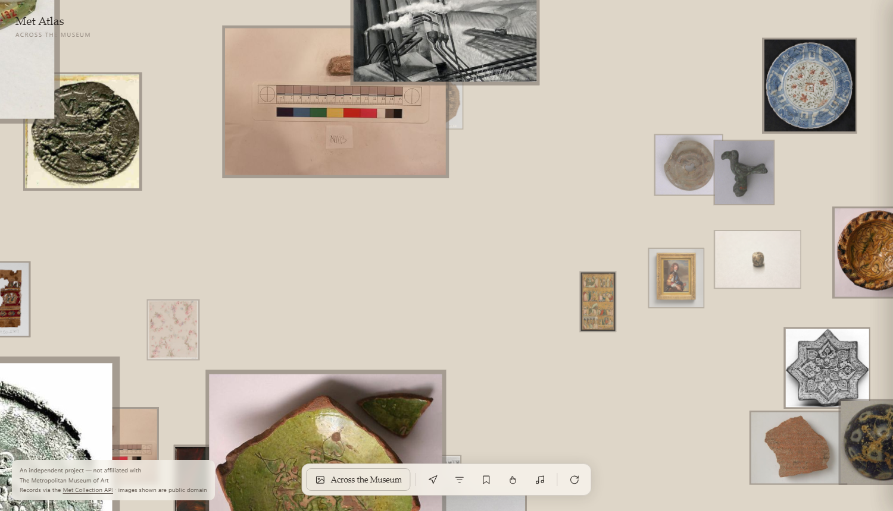

# Met Atlas

An infinite 3D canvas for The Metropolitan Museum of Art's open collection.
Fly through a field of public-domain works, click one to travel to it, filter
and cluster by what the records actually contain — and, if you like, steer it
with your hands.

**One HTML file. No framework, no build step, no dependencies to install.**



---

## Why this was harder than it looks

The visuals are the easy part. Almost all of the work went into three
constraints that only appear once you actually build against the API.

### 1. The image host answers `OPTIONS` with CORS and `GET` without it

WebGL refuses to texture from an image that isn't CORS-clean, and this project
additionally reads pixels back to derive a colour palette the Met doesn't
provide. So `images.metmuseum.org` has to be CORS-clean.

It looks like it is:

```
OPTIONS https://images.metmuseum.org/...   →  Access-Control-Allow-Origin: *
GET     https://images.metmuseum.org/...   →  (no such header)
```

That header is a red herring. Images are *simple requests* — browsers never
preflight them — so the `OPTIONS` response never applies. Every image is
routed through an image proxy that re-serves it CORS-clean, which is also what
makes client-side colour extraction possible at all.

### 2. The API is N+1, behind a WAF that fails invisibly

`/search` and `/objects` return bare `objectID`s. Every single image costs one
further request. The collection also sits behind an Imperva WAF that starts
refusing well below the documented "80 requests per second".

The refusal is the interesting part. Sometimes it's a `403` carrying an HTML
challenge page. More often it returns a response with the CORS header simply
**absent**, which the browser blocks before any JavaScript can read a status —
`fetch` just rejects, indistinguishable from the network dropping.

So the client:

- asks for far less (measured 92% usable yield, so oversampling 1.6× was waste — now 1.25×)
- paces requests in small batches with jittered backoff
- treats *a run of consecutive rejections* as the signal, since no single one is legible
- caches normalised records in `localStorage`, including "fetched, unusable" verdicts
- keeps the last good visit and **replays it if a cold load is blocked**, so a
  first-time visitor never lands on an empty canvas through no fault of their own

### 3. Depth has to be earned on a light background

A dark field can fade works toward black and they recede while still glowing.
On a warm gallery-white ground, fading toward the background *erases* them. So
depth comes from three other places: every work sits on a dark mount board
that reads as a shadow up close and a receding shape at distance; the field is
tight enough that works overlap; and the fog range ends exactly at the field's
back plane, so works are born the colour of the wall and emerge as they
approach.

---

## What it does

- **Explore** — drag to pan, scroll to fly, WASD/arrows, click a work to fly to it
- **Wall label** — full museum record: credit line, accession number, dimensions,
  culture, and whether it is *on view right now and in which gallery*
- **Filter** — date range, colour (computed from image pixels), keyword facets
  derived from what actually loaded
- **Cluster** — regroup the field by department, century, classification or colour
- **Starred** — keep works between visits; click one to fly back to it
- **Gestures** — MediaPipe hand tracking: point to pan, palm to fly, fist to stop,
  peace to focus, two-hand heart to star. Lazy-loaded; the camera is never
  requested until you ask.
- **Gallery sound** — optional public-domain track with a live Web Audio
  frequency visualiser

---

## Stack

Three.js r169 via CDN import map · MediaPipe Tasks-Vision (lazy) · Web Audio ·
The Met Collection API · vanilla everything else.

## Run it

```bash
npx serve . -p 3002
```

Then open <http://localhost:3002>. There is nothing to install or build.

## Tests

Browser automation under `tests/`, run against a local server:

```bash
cd tests && npm install && node flight-health.mjs
```

- `flight-health.mjs` — asserts four field properties **in one pass**: works
  never pile onto the camera axis, the field is never empty, nothing appears
  in plain sight, and no tile thrashes between positions.
- `classify.mjs` — unit-tests the gesture classifier against synthetic hand
  landmarks, with no camera required.

The single-harness design is deliberate. Written as separate checks, each one
was blind to the next bug — a distance-based detector can't see a mirrored
position, and `material.opacity` reports a work as visible when fog has
rendered it invisible, because **fog fades colour, not alpha**.

---

## Still to improve

Written down honestly rather than left for someone else to find.

- **Panning can still bring a work uncomfortably close.** Flying forward and
  backward behave correctly; a fast lateral drag can leave one work large in
  the frame. See the architecture note below — this is a symptom, not the disease.
- **Architecture.** The field recycles a fixed pool of tiles to new positions
  around a moving camera, and essentially every visual bug in this project came
  from that one decision. A deterministic chunked world — where a chunk's
  contents are a pure function of its coordinates and works are *created and
  destroyed* rather than *moved* — removes the whole class. That's the next
  substantial change.
- **Accessibility.** A WebGL canvas with no keyboard-navigable alternative and
  nothing for a screen reader. A parallel list view of the same records would
  fix it and isn't hard.
- **Untested on a physical phone.** The layout is responsive and touch gestures
  are implemented, but "responsive in a resized desktop browser" is not the
  same claim.
- **First load can be slow** when the Met is throttling. The fallback keeps the
  canvas populated, but a genuinely cold visitor may wait.

---

## Credits

An independent project, **not affiliated with The Metropolitan Museum of Art.**

- Records via the [Met Collection API](https://metmuseum.github.io/); all works
  shown are public domain.
- Gallery sound: Erik Satie, *Gymnopédie No. 1*, performed by Agathe Laforge,
  public domain via [Musopen](https://musopen.org/).
- Application code MIT.

The infinite-canvas *concept* was inspired by
[beneb85/visual-atlas](https://github.com/beneb85/visual-atlas). This is an
independent implementation against a different collection, whose API turned
out to impose very different constraints — the CORS asymmetry, the N+1, and the
WAF behaviour above are all specific to The Met.
